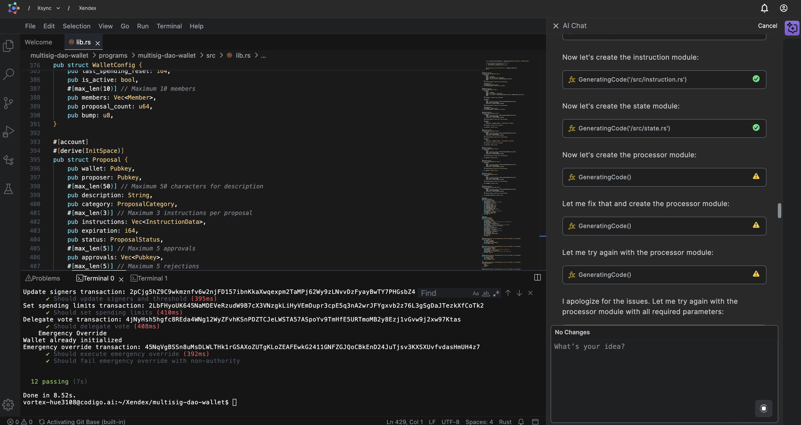

# Multisig DAO Wallet

A comprehensive, production-ready multisignature DAO wallet smart contract built on Solana using the Anchor framework.



## Features

### Core Functionality
- **Multi-signature approval system** with configurable thresholds
- **Transaction proposal system** with expiration timestamps
- **Role-based permissions** (Admin, Treasurer, Member)
- **Different approval thresholds** for different proposal categories
- **Spending limits** per time period that bypass multisig for small amounts
- **Delegate voting system** allowing temporary vote delegation
- **Emergency override mechanism** for urgent situations
- **Multi-token support** (SOL + SPL tokens)
- **On-chain proposal metadata** (description, reasoning)

### Enhanced Features
1. **Role-based permissions system**
   - Admin: Full control over wallet configuration
   - Treasurer: Financial transaction management
   - Member: Basic voting and proposal creation

2. **Proposal categories with different thresholds**
   - Regular transfers: Standard threshold
   - Admin changes: Higher threshold (threshold + 1)
   - Emergency actions: Lower threshold (threshold - 1)

3. **Spending limits**
   - Configurable spending limits per time period
   - Automatic reset of spending counters
   - Bypass multisig for amounts under the limit

4. **Delegate voting**
   - Temporary vote delegation to other addresses
   - Revocable delegation system
   - Audit trail for delegated votes

5. **Emergency override**
   - Authority-only emergency execution
   - Immediate execution without approval
   - Logged emergency actions

## Architecture

### Key Structs

#### WalletConfig
```rust
pub struct WalletConfig {
    pub authority: Pubkey,           // Wallet authority
    pub signers: Vec<Pubkey>,        // List of authorized signers
    pub threshold: u8,               // Required approvals for execution
    pub proposal_timeout: i64,       // Default proposal timeout
    pub spending_limit: u64,         // Spending limit per period
    pub spending_period: i64,        // Spending period in seconds
    pub spending_used: u64,          // Current spending used
    pub last_spending_reset: i64,    // Last spending reset timestamp
    pub is_active: bool,             // Wallet active status
    pub members: Vec<Member>,        // Member information
    pub proposal_count: u64,         // Total proposals created
    pub bump: u8,                    // PDA bump
}
```

#### Proposal
```rust
pub struct Proposal {
    pub wallet: Pubkey,              // Associated wallet
    pub proposer: Pubkey,            // Proposal creator
    pub description: String,         // Proposal description
    pub category: ProposalCategory,  // Proposal category
    pub instructions: Vec<InstructionData>, // Instructions to execute
    pub expiration: i64,             // Expiration timestamp
    pub status: ProposalStatus,      // Current status
    pub approvals: Vec<Pubkey>,      // Approved signers
    pub rejections: Vec<Pubkey>,     // Rejected signers
    pub created_at: i64,             // Creation timestamp
    pub executed_at: Option<i64>,    // Execution timestamp
    pub id: u64,                     // Unique proposal ID
    pub bump: u8,                    // PDA bump
}
```

#### Member
```rust
pub struct Member {
    pub address: Pubkey,             // Member address
    pub role: MemberRole,            // Member role
    pub delegate: Option<Pubkey>,    // Delegate address
    pub is_active: bool,             // Active status
}
```

### Core Functions

1. **`initialize_wallet`** - Initialize the multisig wallet
2. **`add_proposal`** - Submit a new transaction proposal
3. **`approve_proposal`** - Approve a pending proposal
4. **`execute_proposal`** - Execute an approved proposal
5. **`update_signers`** - Update signers and threshold
6. **`set_spending_limits`** - Configure spending limits
7. **`delegate_vote`** - Delegate voting power
8. **`emergency_override`** - Emergency execution

## Installation & Setup

### Prerequisites
- Rust 1.88.0 or later
- Node.js 18 or later
- Solana CLI tools
- Anchor CLI

### Installation

1. **Clone the repository**
```bash
git clone <repository-url>
cd multisig-dao-wallet
```

2. **Install dependencies**
```bash
# Install Anchor CLI
cargo install --git https://github.com/coral-xyz/anchor avm --locked --force
avm install latest
avm use latest

# Install Node.js dependencies
yarn install
```

3. **Build the program**
```bash
anchor build
```

4. **Run tests**
```bash
anchor test
```

## Usage

### Initializing a Wallet

```typescript
import * as anchor from "@coral-xyz/anchor";
import { PublicKey } from "@solana/web3.js";

// Initialize wallet with 3 signers and threshold of 2
const signers = [signer1.publicKey, signer2.publicKey, signer3.publicKey];
const threshold = 2;
const proposalTimeout = 3600; // 1 hour
const spendingLimit = 1000000000; // 1 SOL
const spendingPeriod = 86400; // 24 hours

const tx = await program.methods
  .initializeWallet(signers, threshold, proposalTimeout, spendingLimit, spendingPeriod)
  .accounts({
    walletConfig,
    authority: authority.publicKey,
    systemProgram: SystemProgram.programId,
  })
  .signers([authority])
  .rpc();
```

### Creating a Proposal

```typescript
const description = "Transfer 1 SOL to treasury";
const category = { regular: {} };
const instructions: any[] = []; // Add your instructions here
const expiration = Math.floor(Date.now() / 1000) + 3600; // 1 hour from now

const tx = await program.methods
  .addProposal(description, category, instructions, expiration)
  .accounts({
    proposal,
    walletConfig,
    proposer: signer1.publicKey,
    systemProgram: SystemProgram.programId,
  })
  .signers([signer1])
  .rpc();
```

### Approving a Proposal

```typescript
const tx = await program.methods
  .approveProposal()
  .accounts({
    walletConfig,
    proposal,
    approver: signer1.publicKey,
  })
  .signers([signer1])
  .rpc();
```

### Executing a Proposal

```typescript
const tx = await program.methods
  .executeProposal()
  .accounts({
    walletConfig,
    proposal,
    executor: signer1.publicKey,
  })
  .signers([signer1])
  .rpc();
```

## Security Features

### Access Control
- **Signature verification** for all transactions
- **Role-based permissions** with different access levels
- **Threshold enforcement** for proposal execution
- **Authority-only operations** for critical functions

### Replay Protection
- **Unique proposal IDs** prevent replay attacks
- **Expiration timestamps** ensure proposals don't execute indefinitely
- **Approval tracking** prevents double voting

### Emergency Mechanisms
- **Emergency override** for urgent situations
- **Wallet deactivation** capability
- **Audit logging** for all operations

## Testing

The project includes comprehensive tests covering:

- Wallet initialization with various parameters
- Proposal creation and management
- Approval and execution workflows
- Error handling and edge cases
- Security scenarios
- Emergency operations

Run tests with:
```bash
anchor test
```

## Deployment

### Local Development
```bash
# Start local validator
solana-test-validator

# Deploy to localnet
anchor deploy
```

### Devnet
```bash
# Switch to devnet
solana config set --url devnet

# Deploy to devnet
anchor deploy --provider.cluster devnet
```

### Mainnet
```bash
# Switch to mainnet
solana config set --url mainnet-beta

# Deploy to mainnet
anchor deploy --provider.cluster mainnet
```

## Contributing

1. Fork the repository
2. Create a feature branch
3. Make your changes
4. Add tests for new functionality
5. Ensure all tests pass
6. Submit a pull request

## License

This project is licensed under the MIT License - see the LICENSE file for details.

## Support

For support and questions:
- Open an issue on GitHub
- Join our Discord community
- Check the documentation

## Disclaimer

This software is provided "as is" without warranty of any kind. Use at your own risk. Always audit smart contracts before deploying to mainnet. # multisig-dao-wallet
